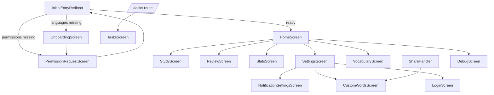

# App Audit – Current State

## 1) Project summary
- App name `learn_languages` @ `pubspec.yaml:1` targeting version 1.0.2+11 with Dart SDK constraint `^3.7.2` (`pubspec.yaml:5-8`).
- Flutter app organised by feature areas: `lib/core` (config & DI), `lib/data` (remote/local repos), `lib/domain` (entities/interfaces), `lib/presentation` (screens/providers/widgets), `lib/services` (audio, learning, notifications), plus generated l10n under `lib/l10n/`.
- Assets shipped: `.env`, `assets/databases/lang_data.db`, Whisper tiny model under `assets/models/ggml-tiny-q8_0.bin` (`pubspec.yaml:64-67`).
- 90 Dart sources (~5.9k LOC) excluding build/generated outputs; largest files are `home_screen.dart` (~525 LOC) and `interactive_word_sentence_card.dart` (~364 LOC).
- Top-level tooling configs include `analysis_options.yaml` (standard `flutter_lints`) and helper scripts (`get_appwrite_schema.py`, `migrate_data.py`) for data operations.

## 2) Dependencies & architecture
- State management: `provider` with `MultiProvider` layering ChangeNotifiers in `MyApp` (`lib/main.dart:61-105`); view models live in `lib/presentation/providers`.
- Dependency injection: `GetIt` service locator configured in `setupLocator()` to register Appwrite-backed repositories, local stores, and shared services (`lib/core/di.dart:37-113`).
- Appwrite SDK (`appwrite ^17.0.1`) underpins all remote data sources via `AppwriteService` wrapper providing CRUD helpers and auth flows (`lib/data/remote/appwrite_service.dart:11-241`).
- Local persistence relies on `sqflite` for anonymous/offline word status & custom word caches (`lib/data/local/local_user_word_status_repo.dart:1-70`, `lib/data/local/local_custom_word_repo.dart:1-64`) plus `shared_preferences` for lightweight settings (`lib/presentation/providers/settings_provider.dart:1-198`).
- Audio/tooling stack pulls in `just_audio`, `record`, `whisper_ggml`, `flutter_local_notifications`, and `timezone` (`pubspec.yaml:17-47`), though several packages (e.g., `audioplayers`, `speech_to_text`, `rxdart`, `url_launcher`) are currently unused in `lib/`.
- `.env` (bundled asset) supplies Appwrite endpoint/project IDs and other runtime constants via `flutter_dotenv` (`lib/core/di.dart:38-45`); API credentials are present but only endpoint/project ID are referenced in-app.

## 3) Features & screens (current)
- **InitialEntryRedirect** gatekeeps onboarding: checks stored languages and permissions before routing to onboarding, permission request, or the main home experience (`lib/presentation/screens/onboarding_screen.dart:200-263`).
- **HomeScreen** is the primary hub with streak widgets, study/review shortcuts, and bottom “pill” navigation to stats/settings (`lib/presentation/screens/home_screen.dart:1-525`). It drives refreshes via `HomeProvider` (progress stats).
- **StudyScreen** delivers new-word practice using `InteractiveWordSentenceCard` batches with audio playback and translation overlays (`lib/presentation/screens/study_screen.dart:1-76`).
- **ReviewScreen** mirrors Study but targets in-progress vocabulary with spaced repetition status buttons (`lib/presentation/screens/review_screen.dart:1-81`).
- **VocabularyScreen** groups learned words into learning/pending/mastered expansion lists (`lib/presentation/screens/vocabulary_screen.dart:1-57`).
- **SettingsScreen** hosts daily goal, locale picker, reminder entry, custom words, and a manual login shortcut (`lib/presentation/screens/settings_screen.dart:1-162`).
- Auxiliary flows include **OnboardingScreen** language selection (`lib/presentation/screens/onboarding_screen.dart:1-199`), **PermissionRequestScreen** to request notifications/mic (`lib/presentation/screens/permission_request_screen.dart:1-63`), **NotificationSettingsScreen** time management (`lib/presentation/screens/notification_settings_screen.dart:1-91`), **CustomWordsScreen** with share intent support (`lib/presentation/screens/custom_words_screen.dart:1-145`), **LoginScreen** (email/password Appwrite session) (`lib/presentation/screens/login_screen.dart:1-84`), **TasksScreen** placeholder for sentence tasks (`lib/presentation/screens/tasks_screen.dart:1-35`), and **DebugScreen** to inspect word statuses (`lib/presentation/screens/debug_screen.dart:1-56`).

## 4) Data layer & Appwrite usage
- Central constants map Appwrite resource IDs (`lib/core/constants.dart:15-28`), aligning with collections noted in the migration brief (e.g., `words`, `sentences`, `user_word_status`). `kAppwriteSentenceTasks`, `kAppwriteUserSentenceTasks`, `kAppwriteTaskTranslations`, `kAppwriteUserVocabulary` still use readable slugs rather than 24-char Appwrite IDs.
- `AppwriteService` exposes CRUD + auth, seeds initial `user_word_status` documents on register/login, and supports storage file downloads for audio assets (`lib/data/remote/appwrite_service.dart:37-140`).
- Schema agility is handled by `AppwriteSchemaProbe`, sampling `languages` & `words` to set dynamic field names in `SchemaFields` (`lib/core/appwrite_schema_probe.dart:1-79`, `lib/core/schema_fields.dart:1-33`).
- Remote repositories cover: words (`RemoteWordRepository` with language/rank filters & fallbacks on 400 errors – `lib/data/remote/remote_word_repo.dart:1-118`), sentences (relation-driven fetch with group-language queries – `lib/data/remote/remote_sentence_repo.dart:1-138`), languages (`lib/data/remote/remote_language_repo.dart:1-21`), word-sentence links (`lib/data/remote/remote_word_sentence_link_repo.dart:1-24`), reading materials & sentence joins (`lib/data/remote/remote_reading_material_repo.dart:1-24`, `lib/data/remote/remote_material_sentence_repo.dart:1-24`), user vocabulary & statuses (`lib/data/remote/remote_user_vocabulary_repo.dart:1-33`, `lib/data/remote/remote_user_word_status_repo.dart:1-70`), sentence tasks & user task completions (`lib/data/remote/remote_sentence_task_repo.dart:8-22`, `lib/data/remote/remote_user_sentence_task_repo.dart:6-27`), and task translations (`lib/data/remote/remote_task_translation_repo.dart:1-28`).
- Task retrieval remains incomplete: `RemoteTaskRepository.fetchBySentence` throws `UnimplementedError` (`lib/data/remote/remote_task_repo.dart:13-19`), and `TaskProvider.fetchTasksForSentence` never populates `_tasks` because the repo lacks ID-based fetches (`lib/presentation/providers/task_provider.dart:31-44`).
- Model classes map dynamic Appwrite payloads with defensive fallbacks (e.g., `Word.fromMap` respecting probed field names `SchemaFields.wordLanguageRef`/`wordText` – `lib/domain/entities/word.dart:13-41`; `Sentence.fromMap` handles relation objects/audio IDs – `lib/domain/entities/sentence.dart:13-63`).
- No Appwrite schema export file (`docs/appwrite_schema_dump.md`) is present; code relies solely on runtime probing plus hardcoded IDs.

## 5) Audio / media handling
- Playback uses `just_audio` within `InteractiveWordSentenceCard`, resolving either absolute URLs or IDs joined to a configurable `TATOEBA_DOWNLOAD_BASE` env (`lib/presentation/widgets/interactive_word_sentence_card.dart:97-183`).
- Speech capture/transcription leverages Whisper models via `SpeechRecognitionService` and orchestrated scoring through `AudioCheckService.compare` using Levenshtein similarity (`lib/services/speech_recognition_service.dart:1-56`, `lib/services/audio_check_service.dart:18-90`, `lib/services/pronunciation_scoring_service.dart:1-32`).
- `AudioCheckService.downloadRef` performs raw HTTP downloads to cache Appwrite/Tatoeba audio locally (`lib/services/audio_check_service.dart:52-69`). No direct usage of `audioplayers` package was found.
- Recording entry points (e.g., `record`, `speech_to_text`) are not yet wired into UI flows, indicating future pronunciation tasks are still under construction.

## 6) Local storage & config
- `.env` supplies `APPWRITE_ENDPOINT`, `APPWRITE_PROJECT_ID`, `APPWRITE_API_KEY`, and collection IDs; only the endpoint/project ID are consumed at runtime (`.env`, `lib/core/di.dart:38-45`). The API key remains unused in code but represents a secret bundled with the app.
- User preferences persist daily goals, locales, streak metadata, and per-language counters via `SharedPreferences` (`lib/presentation/providers/settings_provider.dart:11-167`). Notification schedules are cached as serialized `hh:mm` strings (`lib/presentation/providers/notification_settings_provider.dart:1-45`).
- Offline/anonymous progress is stored in a separate Sqflite DB created by `openUserLocalDb()` with a `user_word_status` table and adaptive routing between local/remote repositories depending on login state (`lib/core/local_db.dart:1-24`, `lib/data/user_word_status/adaptive_user_word_status_repo.dart:16-62`). Custom words use another Sqflite table with migration logic for `language_code` (`lib/data/local/local_custom_word_repo.dart:1-52`).
- A bundled `lang_data.db` asset is referenced in constants but the local word/sentence repositories remain unimplemented placeholders (`lib/data/local/local_word_repo.dart:1-24`, `lib/data/local/local_sentence_repo.dart:1-24`).

## 7) i18n / L10n & accessibility
- `flutter_localizations` and generated `AppLocalizations` are wired into `MaterialApp` (`lib/main.dart:111-118`).
- Seven ARB files cover English, Spanish, Russian, French, German, Italian, Portuguese strings with pluralization and reminder messaging (`lib/l10n/app_en.arb`, etc.).
- Locale selection flows through `SettingsProvider.setLocale` and onboarding language choices, but UI widgets often embed raw English copy (e.g., Study/Review buttons) pending localization.
- No explicit accessibility helpers (semantic labels, large text handling) were observed; major screens lean on custom gradients and rotated widgets that may impact readability.

## 8) Testing & CI/CD
- Test coverage is minimal: a single placeholder widget test and a trivial smoke test (`test/widget_test.dart:1-22`, `test/local_srs_repo_smoke_test.dart:1-6`).
- No Appwrite mocks, provider tests, or audio logic validations are present; integration with remote services is untested.
- No CI/CD workflows (e.g., GitHub Actions) or build scripts were detected in the repository.

## 9) Gaps / tech debt (observed)
- Task workflow is incomplete: repositories and providers never surface Appwrite tasks, and collection IDs for tasks/user-task tables are still human-readable slugs (risk of runtime 404s) (`lib/data/remote/remote_task_repo.dart:13-19`, `lib/core/constants.dart:24-27`).
- Several dependencies remain unused (`audioplayers`, `speech_to_text`, `rxdart`, `url_launcher`), hinting at unfinished features or opportunities to slim the bundle (`pubspec.yaml:25-45`).
- Heavy reliance on `print` / `debugPrint` for error handling across services and widgets (`lib/services/learning_service.dart:101-177`, `lib/presentation/widgets/interactive_word_sentence_card.dart:97-143`) diverges from preferred structured logging and may leak PII.
- Notification scheduling assumes a non-null `navigatorKey.currentContext`, which can break during cold start/background scheduling (`lib/services/notification_service.dart:73-110`).
- Local repositories for offline word/sentence/task data are scaffolds only (`lib/data/local/local_word_repo.dart:1-24`), and there is no migration path for the bundled `lang_data.db`.
- Security: shipping `.env` with an Appwrite API key increases exposure risk; consider runtime injection via `--dart-define`.
- UI/UX debt: `HomeScreen` is a 500+ LOC monolith with manual gradients and magic numbers, complicating maintenance (`lib/presentation/screens/home_screen.dart:1-525`).

## 10) Appendix
**Route graph (Mermaid)**

**Dependency summary**
- `appwrite` for auth/database; `flutter_dotenv` to read `.env` (`lib/core/di.dart:38-61`).
- `provider` + `get_it` for state & DI (`lib/main.dart:61-105`, `lib/core/di.dart:37-113`).
- `sqflite`, `shared_preferences` for local persistence (`lib/core/local_db.dart:1-24`, `lib/presentation/providers/settings_provider.dart:11-198`).
- `just_audio`, `whisper_ggml`, `record`, `http` for media capture/playback (`lib/presentation/widgets/interactive_word_sentence_card.dart:97-144`, `lib/services/audio_check_service.dart:18-90`).
- `flutter_local_notifications`, `timezone`, `permission_handler` for reminders and gating (`lib/services/notification_service.dart:46-112`, `lib/presentation/screens/permission_request_screen.dart:16-54`).

**File metrics**
- 90 Dart files tracked; cumulative ~5,887 LOC (non-generated). Largest modules: `home_screen.dart` (~525 LOC), `interactive_word_sentence_card.dart` (~364 LOC).
- Presentation layer dominates (≈45% of LOC), followed by services/data (≈35%), domain/core (≈20%).
- No generated router or build-runner output checked into the tree.
